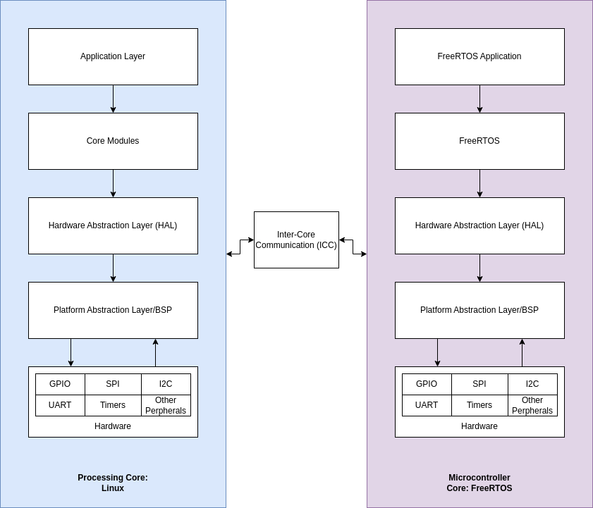
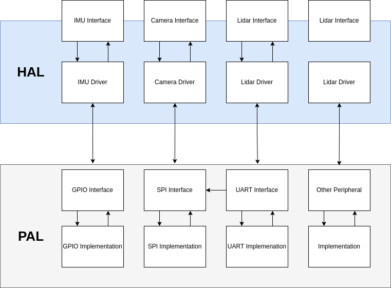

# System Design

<!--toc:start-->

- [System Design](#system-design)
  - [Key Components](#key-components)
  - [Platform Abstraction Layer (PAL)/BSP](#platform-abstraction-layer-palbsp)
  - [Hardware Abstraction Layer (HAL)](#hardware-abstraction-layer-hal)
  - [Inter-Core Communication (ICC) Layer](#inter-core-communication-icc-layer)
  - [Core Modules](#core-modules)
  <!--toc:end-->

<!--toc:start-->

- [System Design](#system-design)
  - [Key Components](#key-components)

The hexapod robot software architecture aims to be modular, scalable, and maintainable.
The architecture is designed to be cross-platform, ensuring that the same design principles can
be applied regardless of the specific hardware platform used.

## Key Components

1. Platform Abstraction Layer (PAL)/BSP
2. Hardware Abstraction Layer (HAL)
3. Inter-Core Communication (ICC) Layer
4. Core Modules
5. Application Layer

The design leverages a dual asymetric processing setup, where one core runs Linux and handles high-level processing
and sensor data acquisition (DAQ), while the other core runs FreeRTOS and manages low-level servo control.
This design separates high-level processing tasks from low-level real-time tasks. From a hardware perspective, it is flexible
as to how this can be implemented. We could have two seperate chips: a Microprocessor and a Microcontroller which communicate
via a external interface. Another setup is instead have both cores on the same SoC.

- **Core A (Linux Core):**
  Handles high-level processing, sensor data acquisition (DAQ), and overall control logic.
  Communicates with the MCU core to delegate real-time tasks.
- **Core B (MCU Core):**
  Handles low-level servo control and real-time operations.
  Receives commands from the Linux core and sends status updates back.

## Platform Abstraction Layer (PAL)/BSP

The Platform Abstraction Layer (PAL) is a critical component of the hexapod robot's software architecture.
It provides a consistent API for interacting with low-level hardware peripherals (such as GPIO, SPI, I2C, UART)
across multiple System on Chips (SoCs) and platforms. This abstraction ensures that the higher-level application and
HAL code remain platform-agnostic, facilitating portability and maintainability.

How this is implemented will vary from platform to platform, chip to chip. This layer could call vendor specific libraries
or driver code. It could also call cross platform libraries that accomplish this task. We allow easy swapping of
underlying libraries or drivers without affecting the higher-level code; while supporting a wide range of peripherals
across different platforms.

The PAL defines interfaces for each type of hardware peripheral (such as GPIO), as well as communication protocols (such
as SPI, UART). For each PAL interface, there are platform-specific implementations that leverage the appropriate libraries
or drivers for the target platform. This approach abstracts the details of the underlying hardware and provides a consistent
API for the higher-level code.

To manage the selection of the appropriate PAL implementation for a given platform, a configuration mechanism is used.
This can be done through compile-time directives, these can be set using `menuconfig`.

The reccomended implementation is through the use of [WiringX](https://github.com/wiringX/wiringX), a library that
allows developers to control the GPIO of various platforms with generic and uniform functions. By using wiringX,
the same code will run on all platforms supported by wiringX, natively.

## Hardware Abstraction Layer (HAL)

The Hardware Abstraction Layer (HAL) provides a uniform interface for higher-level code to interact with various
hardware components, such as IMUs, servos, and other sensors. The HAL abstracts away the specific details of the
hardware, allowing for easy swapping of devices without affecting the higher-level logic. There is heavy emphasis on
a modular design, allowing easy integration of new hardware components without significant changes to the system.

The HAL defines interfaces for each type of hardware component, such as sensors and actuators. These interfaces standardize
the way the higher-level code interacts with the hardware, ensuring consistency across different devices.

Device drivers are concrete implementations of the HAL interfaces. Each driver interacts with a specific hardware component,
implementing the HAL interface methods using the PAL to perform low-level hardware communication. This allows the HAL to
remain platform-agnostic, as the PAL abstracts the details of the low-level hardware communication.

For example, the HAL can define a IMU Interface, this interface can utilize the device drivers for a variety of IMU's, such as the
MPU6050 or the BNO055. Higher level logic does not need to be concerned with specific device implementation; but only use the
IMU interface provided by the HAL. This design allows for easy bring up or swapping of hardware.

## Inter-Core Communication (ICC) Layer

The Inter-Core Communication (ICC) layer facilitates communication between the Linux core (Core A) and the MCU core (Core B).
This layer abstracts the underlying communication mechanisms between the cores, as this can vary based on the setup.

The ICC layer defines interfaces for sending and receiving messages between cores. These interfaces standardize the way
communication is handled, ensuring consistency across different platforms and protocols. If both cores are on seperate chips, then
the ICC can utilize the PAL to faciliate communication between the two processes using communication protocols such as UART. On platforms where both cores lie on the same SoC,
we can utilize frameworks such as the Linux Mailbox, or OpenAMP.

## Core Modules

The core modules are responsible for the main functionalities and control logic of the system. These modules handle tasks
such as movement control, sensor data processing, and overall system management.
